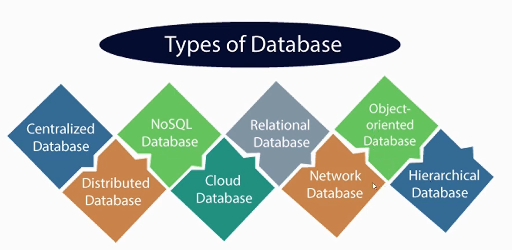
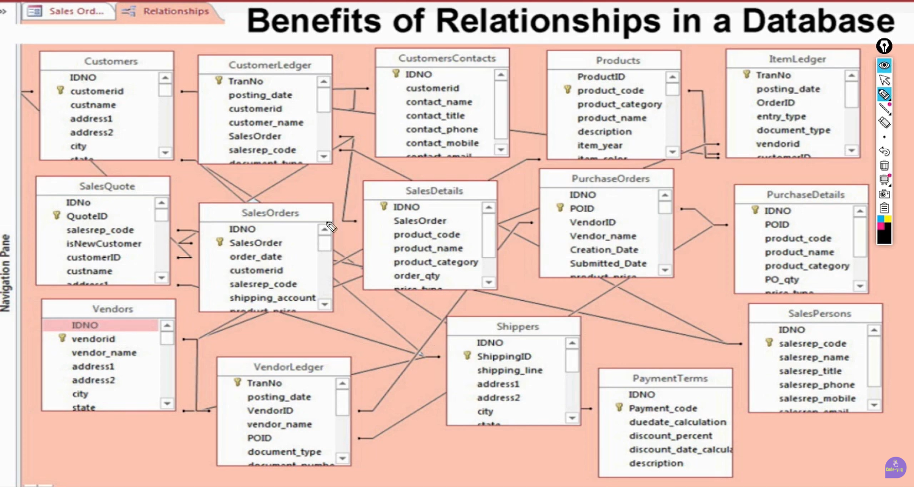
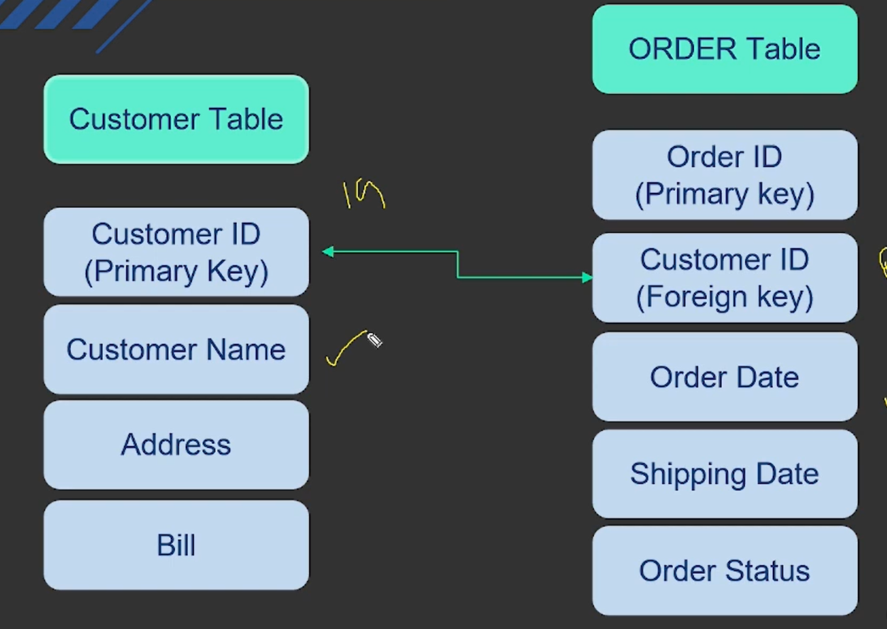
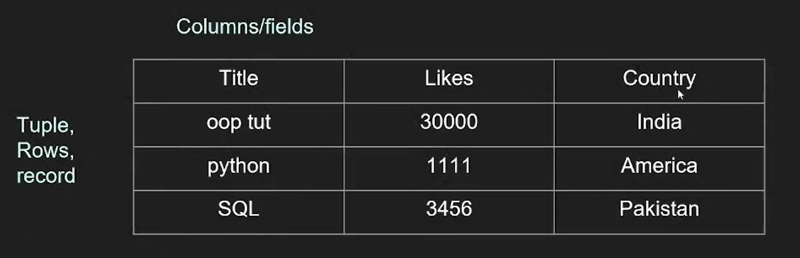
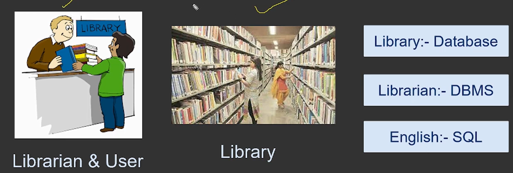
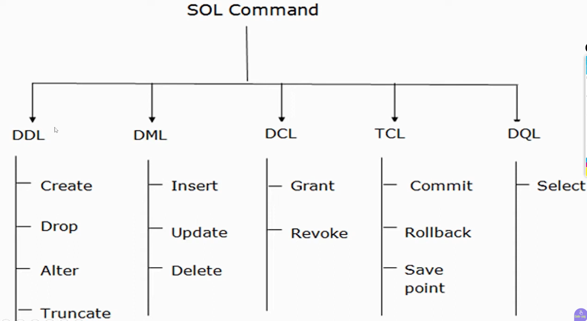

# MySql Notes

## Basics - What is Database?

it consists of 2 words data and base. data is the information that we want to store and base is the place where we want to store that data. so database is a place where we can store our data in an organized way.

### What is Data ?

- Data is a word originated from 'Datum'. Datum(singular form) represents a single piece of information.
- Data(plural form) is a collection of facts, such as numbers, words, measurements, observations or even just descriptions of things. Data can be in the form of text, numbers, images, audio or video. It can be structured (organized in a specific format) or unstructured (not organized in a specific format).
- Data is used to gain insights, make decisions and solve problems in various fields such as science, business, healthcare and more.
- we can store our data in a file, but it is not efficient and secure way to store data. so we use database to store our data in an organized way.



### Relational Database is defined as

A relational database is a way of structuring information in **tables**. An RDB has the ability to establish Links or **relationships-between information** by **joining tables**, which makes it easy to understand and **gain insights** about the relationship between various data points.





### Concept of tables in database

- table have rows(tuple,record) and columns(field). each row represents a record(tuple) and each column represents a field.
- field datatype can be string, integer, date etc. it defines the type of data that can be stored in that field.
- each table have a **primary key** which is a **unique identifier** for **each record** in the table.
- **primary key** **can** be a **single column or a combination of columns**. foreign key is a column that **references the primary key of another table**. it is used to establish a **relationship** between two tables.



### Understanding DBMS with example infographic

we go to librarian, ask for a book, librarian will ask for the name of the book, author name, publication year etc. then librarian will search for the book in the library and give it to us. in this example, librarian is acting as a DBMS and library is acting as a database.



## What is SQL?

- SQL Stands for Structured Query Language.
- It is a computer programming language used to communicate with relational databases.
- SQL is descriptive language. No loops and control flows
- SQL is used to perform various operations on the data in the database such as **inserting, updating, deleting and retrieving data**.
- SQL is a standard language for relational database management systems. It is used by many database systems such as MySQL, PostgreSQL, Oracle, SQL Server etc.
- SQL is a powerful language that allows us to **manipulate and query data** in a relational database. It is widely used in various applications such as web development, data analysis, business intelligence and more.

### Main usage of SQL

- **Data Definition Language (DDL)**: used to define the **structure of the database** **and its objects** such as **tables**, **views**, **indexes** etc. it includes commands such as `CREATE`, `ALTER`,`DROP` etc.
- **Data Query Language (DQL)**: used to **retrieve data** from the database. it includes the `SELECT` command.
- **Data Manipulation Language (DML)**: used to **manipulate the data** in the database. it includes commands such as `INSERT`, `UPDATE`, `DELETE` etc.
- **Data Control Language (DCL)**: used to **control the access to the data** in the database. it includes commands such as `GRANT`, `REVOKE` etc.
- **Transaction Control Language (TCL)**: used to **manage transactions** in the database. it includes commands such as `COMMIT`, `ROLLBACK` etc.



#### Best practices for writing SQL queries

- **Database** name **must be unique** and should **not contain spaces or special characters**. it should be descriptive and meaningful.
- Use **uppercase** for SQL keywords and **lowercase** for **table** and **column names** to improve readability.
- Use **consistent formatting** for your SQL queries, such as using the same indentation and line breaks for all queries.
- Use **meaningful names** for tables and columns.
- Use **indentation** and **line breaks** to make the query more readable.
- Use **comments** to explain the purpose of the query and the logic behind it.
- **Always** end SQL command with a **semicolon (`;`)** to indicate the end of the command.
- Avoid using `SELECT *` and instead specify the columns that you want to retrieve.
- Use **aliases** to make the query more readable and to avoid ambiguity.
- Use **parameterized queries** to prevent SQL injection attacks.

### accessing mysql from terminal

```bash
# login to mysql from terminal
mysql -u dbmaster -p
```

```sql
-- show all database schemas in mysql
show databases;
```

```sql
-- schema is a collection of tables in mysql
-- change schema to use
use test_schema;

-- show all tables in the current schema
show tables;
```

### MySQL Workbench

MySQL Workbench is a visual tool for database architects, developers and DBAs.

It provides a graphical interface for designing, developing and administering MySQL databases. It allows users to create and manage databases, tables, views, stored procedures, triggers and more.

It also provides features such as data modeling, SQL development, database administration and performance tuning. MySQL Workbench is available for Windows, macOS and Linux.

### MySQL Datatype - Links

- [Data Types (Version 8.4)](https://www.w3schools.com/mysql/mysql_datatypes.asp)
- [MySQL data types](https://www.mysqldatatypes.com/)

### DLL Commands

#### Create Database

```sql
CREATE DATABASE IF NOT EXISTS database_name
CHARACTER SET utf8mb4 -- it is optional to specify. it is just like encoding. default value is utf8mb4.
COLLATE utf8mb4_general_ci -- these are rules of mysql, who are applied when comparing and sorting data. when we write SORT query, so it follow some rules
ENCRYPTION='Y'; -- default value is 'N'. it is used to encrypt the database. when we set it to 'Y', so all the data in the database will be encrypted.
```

#### Show which values are set by default when we create a database

```sql
SHOW CREATE DATABASE database_name;
```

#### select database to work with

```sql
USE database_name;
```

#### list down available databases

```sql
SHOW DATABASES;
SELECT SCHEMA_NAME FROM INFORMATION_SCHEMA.SCHEMATA;
```

#### delete a database

```sql
DROP DATABASE database_name; -- GIVE ERROR IF NOTHING FOUND
DROP DATABASE IF EXISTS database_name; -- NO ERROR IF NOTHING FOUND
```
