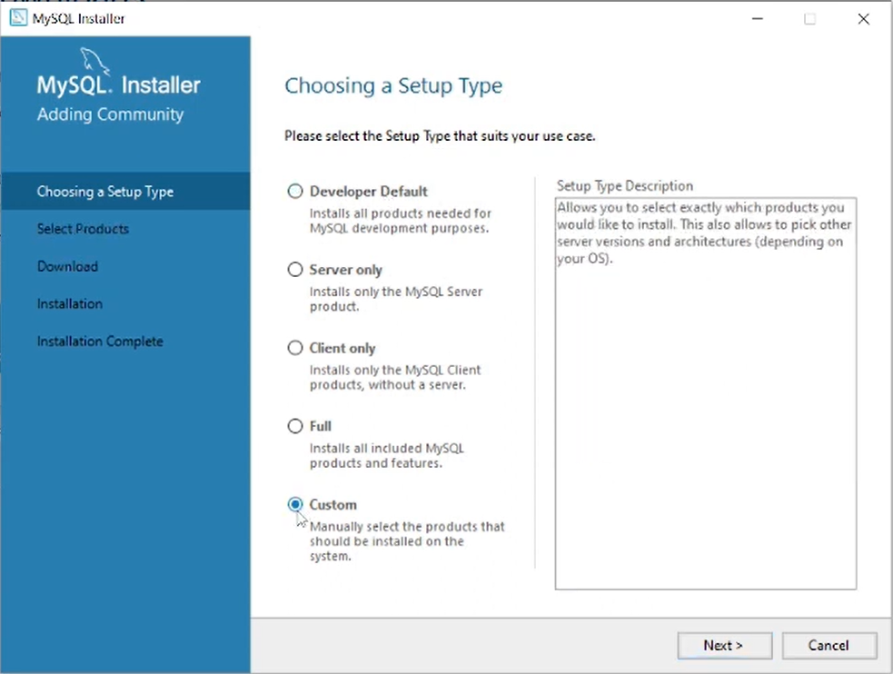
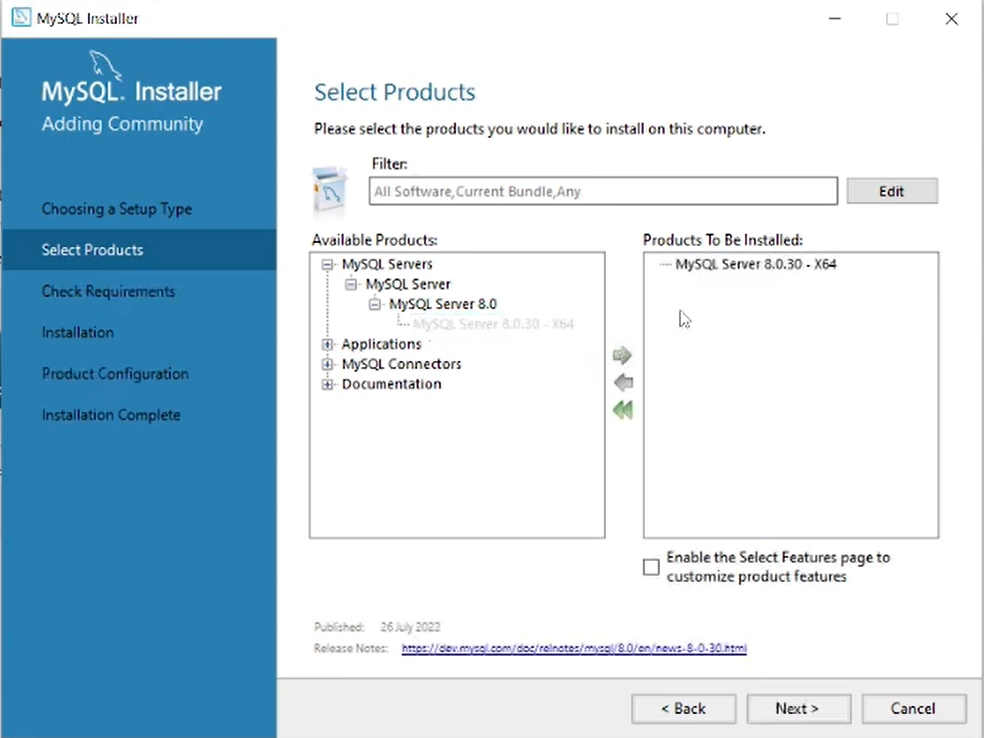
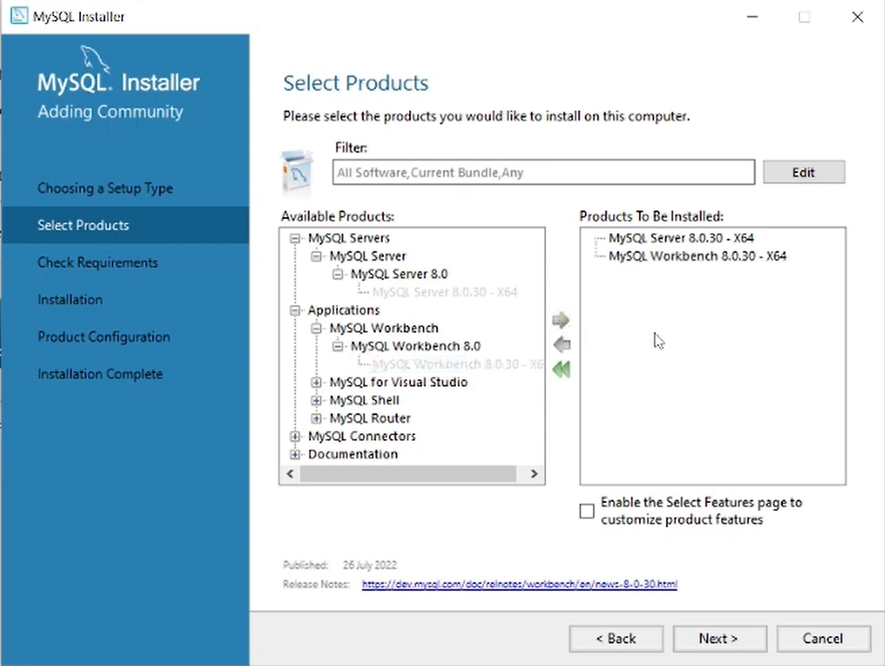
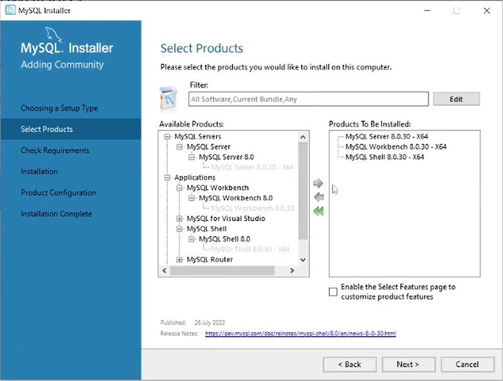
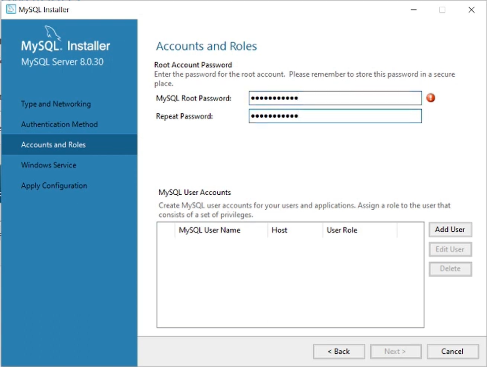
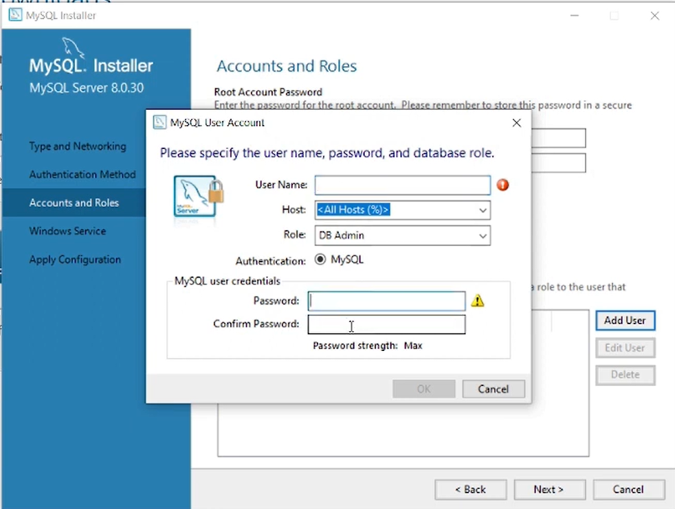

# Python and MySQL

## Introduction

MySQL is a popular open-source relational database management system. It is widely used for web applications. To connect Python applications to a MySQL database, we need to use a connector or driver. This allows us to execute SQL queries and manage the database from our Python code.

we require three things:-

**MySQL**
· Open source database management system.

**Connector or Driver**
· connector is a program that establishes connection between python programs & mysql database.

### Install MySQL on Windows OS

- [Video - How to Install MySQL on Windows OS](https://www.youtube.com/watch?v=pF65fngS0dg)
- [windows Installer - webpage](https://dev.mysql.com/downloads/installer/)

- 
- 
- 
- 
- 
- 

### default Credentials

- port : 3306
- host : localhost
- username : root / dbmaster(DBAdmin)
- password : (the one you set during installation)
